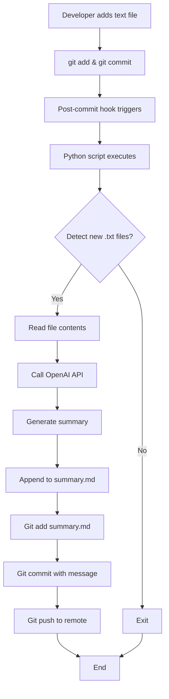

# Text File Summarization Automation - Implementation Plan

## Overview
This system automatically detects new text files added to the repository, generates AI-powered summaries using OpenAI API, and commits/pushes the changes to GitHub.

## Architecture



## Components

### 1. Python Summarization Script (`scripts/summarize_text.py`)
**Purpose**: Core logic for detecting, reading, summarizing, and committing text files

**Key Functions**:
- `get_new_text_files()`: Detects newly added .txt files in the last commit
- `read_file_content(filepath)`: Reads and returns file contents
- `generate_summary(content, filename)`: Calls OpenAI API to generate summary
- `append_to_summary_md(filename, summary)`: Appends formatted summary with timestamp
- `commit_and_push()`: Commits summary.md and pushes to GitHub

**Dependencies**:
- `openai`: For AI-powered summarization
- `gitpython`: For Git operations
- `python-dotenv`: For environment variable management

### 2. Configuration File (`.env`)
**Purpose**: Securely store OpenAI API key

**Contents**:
```
OPENAI_API_KEY=your_api_key_here
```

**Security**: This file is excluded from Git via `.gitignore`

### 3. Post-Commit Hook (`.git/hooks/post-commit`)
**Purpose**: Automatically trigger summarization after each commit

**Behavior**:
- Executes after successful commit
- Runs Python script in background
- Handles errors gracefully

**Script Type**: Shell script (Bash/PowerShell compatible)

### 4. Requirements File (`requirements.txt`)
**Purpose**: Define Python dependencies for easy installation

**Contents**:
```
openai>=1.0.0
gitpython>=3.1.0
python-dotenv>=1.0.0
```

### 5. Summary Output (`summary.md`)
**Purpose**: Store all generated summaries

**Format**:
```markdown
# Text File Summaries

## [filename.txt] - YYYY-MM-DD HH:MM:SS

[AI-generated summary]

---

## [another_file.txt] - YYYY-MM-DD HH:MM:SS

[AI-generated summary]

---
```

## Workflow

### Initial Setup
1. Clone repository
2. Install Python dependencies: `pip install -r requirements.txt`
3. Create `.env` file with OpenAI API key
4. Ensure post-commit hook is executable
5. Initialize Git repository if not already done

### Daily Usage
1. Developer creates/adds a new text file (e.g., `notes.txt`)
2. Developer commits: `git add notes.txt && git commit -m "Add notes"`
3. Post-commit hook automatically triggers
4. Python script:
   - Detects `notes.txt` as new file
   - Reads its contents
   - Generates AI summary via OpenAI
   - Appends summary to `summary.md`
   - Commits `summary.md`
   - Pushes both commits to GitHub
5. GitHub repository now contains both the text file and its summary

## Error Handling

### Scenarios Covered
- **No OpenAI API key**: Script exits with clear error message
- **API rate limits**: Implements retry logic with exponential backoff
- **Network failures**: Graceful error handling, doesn't block commit
- **No new text files**: Script exits silently
- **Git push failures**: Logs error but doesn't fail the commit

## Security Considerations

1. **API Key Protection**: 
   - Stored in `.env` file
   - `.env` excluded from Git via `.gitignore`
   - Never hardcoded in scripts

2. **Git Credentials**:
   - Uses existing Git configuration
   - Relies on SSH keys or credential manager

3. **File Access**:
   - Only reads `.txt` files
   - No modification of original text files

## Customization Options

### File Types
Modify the file extension filter in `get_new_text_files()`:
```python
# Current: only .txt files
if file.endswith('.txt'):

# Example: support multiple types
if file.endswith(('.txt', '.md', '.log')):
```

### Summary Format
Customize the OpenAI prompt in `generate_summary()`:
```python
prompt = f"Summarize the following text in 2-3 sentences:\n\n{content}"
```

### Commit Messages
Modify commit message template in `commit_and_push()`:
```python
repo.index.commit(f"Add summary for {filename}")
```

## Testing Strategy

1. **Unit Tests**: Test individual functions with mock data
2. **Integration Test**: Add sample text file and verify complete workflow
3. **Edge Cases**: 
   - Empty text files
   - Very large files
   - Special characters in filenames
   - Multiple files in single commit

## Maintenance

### Regular Tasks
- Monitor OpenAI API usage and costs
- Update dependencies periodically
- Review and clean up old summaries if needed

### Troubleshooting
- Check `.git/hooks/post-commit` is executable
- Verify `.env` file exists and contains valid API key
- Check Git remote is configured correctly
- Review Python script logs for errors

## Future Enhancements

1. **Multi-language Support**: Detect and summarize in file's language
2. **Summary Quality Control**: Add confidence scores
3. **Batch Processing**: Handle multiple files more efficiently
4. **Web Dashboard**: View all summaries in a web interface
5. **Notification System**: Email/Slack alerts for new summaries
6. **Summary Versioning**: Track changes to summaries over time

## Dependencies

- **Python**: 3.8 or higher
- **Git**: 2.0 or higher
- **OpenAI API**: Active account with API access
- **Internet Connection**: Required for API calls and Git push

## File Structure

```
repository/
├── .git/
│   └── hooks/
│       └── post-commit          # Git hook script
├── scripts/
│   └── summarize_text.py        # Main Python script
├── .env                         # API key (not in Git)
├── .gitignore                   # Excludes .env
├── requirements.txt             # Python dependencies
├── README.md                    # User documentation
├── IMPLEMENTATION_PLAN.md       # This file
└── summary.md                   # Generated summaries
```

## Success Criteria

- ✅ New text files are automatically detected
- ✅ Summaries are generated using AI
- ✅ Summaries are appended to summary.md with metadata
- ✅ Changes are automatically committed and pushed
- ✅ Process is transparent and doesn't interfere with normal workflow
- ✅ Errors are handled gracefully
- ✅ Setup is straightforward with clear documentation
