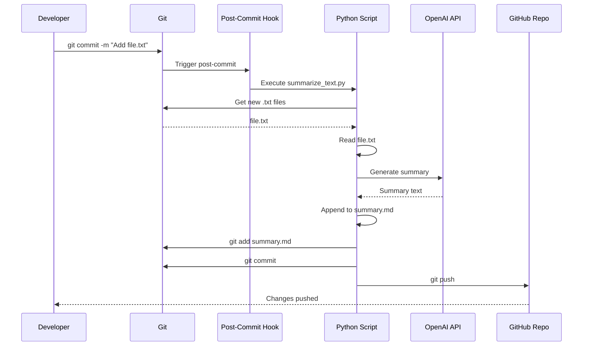

# Technical Specification - Text File Summarization System

## System Requirements

### Software Requirements
- **Python**: 3.8+
- **Git**: 2.0+
- **Operating System**: Windows 11 (PowerShell), Linux, or macOS
- **Internet**: Required for OpenAI API and Git push operations

### API Requirements
- **OpenAI API Key**: Valid API key with GPT access
- **Git Remote**: Configured GitHub repository with push access

## Component Specifications

### 1. Python Summarization Script

**File**: `scripts/summarize_text.py`

**Functions**:

#### `get_new_text_files() -> List[str]`
```python
"""
Detects newly added .txt files in the most recent commit.

Returns:
    List of file paths for new .txt files

Implementation:
    - Uses GitPython to access repository
    - Compares HEAD with HEAD~1
    - Filters for .txt files with 'A' (added) status
    - Returns empty list if no new files found
"""
```

#### `read_file_content(filepath: str) -> str`
```python
"""
Reads and returns the content of a text file.

Args:
    filepath: Relative path to the text file

Returns:
    String content of the file

Error Handling:
    - FileNotFoundError: Returns empty string
    - UnicodeDecodeError: Tries different encodings (utf-8, latin-1)
"""
```

#### `generate_summary(content: str, filename: str) -> str`
```python
"""
Generates AI-powered summary using OpenAI API.

Args:
    content: Text content to summarize
    filename: Name of the file (for context)

Returns:
    Generated summary string

API Configuration:
    - Model: gpt-3.5-turbo or gpt-4
    - Max tokens: 150
    - Temperature: 0.7
    - System prompt: "You are a helpful assistant that creates concise summaries."

Error Handling:
    - API errors: Returns fallback summary
    - Rate limits: Implements exponential backoff
    - Empty content: Returns "No content to summarize"
"""
```

#### `append_to_summary_md(filename: str, summary: str) -> None`
```python
"""
Appends formatted summary to summary.md file.

Args:
    filename: Name of the summarized file
    summary: Generated summary text

Format:
    ## [filename] - YYYY-MM-DD HH:MM:SS
    
    [summary text]
    
    ---

Behavior:
    - Creates summary.md if it doesn't exist
    - Appends to existing file
    - Uses UTC timestamp
    - Adds separator line between entries
"""
```

#### `commit_and_push() -> bool`
```python
"""
Commits summary.md and pushes to remote repository.

Returns:
    True if successful, False otherwise

Git Operations:
    1. git add summary.md
    2. git commit -m "Update summaries for new text files"
    3. git push origin <current_branch>

Error Handling:
    - Checks if summary.md has changes
    - Handles push failures gracefully
    - Logs errors but doesn't raise exceptions
"""
```

#### `main() -> None`
```python
"""
Main execution function orchestrating the workflow.

Workflow:
    1. Load environment variables
    2. Validate OpenAI API key
    3. Get new text files
    4. For each file:
        a. Read content
        b. Generate summary
        c. Append to summary.md
    5. Commit and push changes

Exit Codes:
    0: Success
    1: Configuration error (missing API key)
    2: Git operation error
"""
```

### 2. Post-Commit Hook

**File**: `.git/hooks/post-commit`

**Type**: Shell script (Bash/PowerShell compatible)

**Specification**:
```bash
#!/bin/sh
# Post-commit hook for text file summarization

# Get the repository root directory
REPO_ROOT=$(git rev-parse --show-toplevel)

# Path to Python script
SCRIPT_PATH="$REPO_ROOT/scripts/summarize_text.py"

# Check if Python script exists
if [ -f "$SCRIPT_PATH" ]; then
    # Run Python script in background
    python "$SCRIPT_PATH" &
else
    echo "Warning: Summarization script not found at $SCRIPT_PATH"
fi

exit 0
```

**Windows PowerShell Version**:
```powershell
# Post-commit hook for Windows
$repoRoot = git rev-parse --show-toplevel
$scriptPath = Join-Path $repoRoot "scripts\summarize_text.py"

if (Test-Path $scriptPath) {
    Start-Process python -ArgumentList $scriptPath -NoNewWindow
}

exit 0
```

**Permissions**: Must be executable (`chmod +x .git/hooks/post-commit`)

### 3. Configuration File

**File**: `.env`

**Format**:
```
OPENAI_API_KEY=sk-proj-xxxxxxxxxxxxxxxxxxxxx
OPENAI_MODEL=gpt-3.5-turbo
MAX_TOKENS=150
TEMPERATURE=0.7
```

**Security**:
- Never committed to Git
- Listed in `.gitignore`
- Readable only by user (chmod 600)

### 4. Dependencies File

**File**: `requirements.txt`

**Contents**:
```
openai>=1.0.0
gitpython>=3.1.40
python-dotenv>=1.0.0
```

**Installation**: `pip install -r requirements.txt`

### 5. Git Ignore File

**File**: `.gitignore`

**Contents**:
```
# Environment variables
.env
.env.local

# Python
__pycache__/
*.py[cod]
*$py.class
*.so
.Python
venv/
env/

# IDE
.vscode/
.idea/

# OS
.DS_Store
Thumbs.db
```

## Data Flow Diagram



## Error Handling Strategy

### Critical Errors (Stop Execution)
1. **Missing API Key**: Exit with error message
2. **Invalid Git Repository**: Exit with error message

### Non-Critical Errors (Log and Continue)
1. **API Rate Limit**: Wait and retry (3 attempts)
2. **Network Timeout**: Log error, skip file
3. **Push Failure**: Log error, leave changes uncommitted
4. **File Read Error**: Log error, skip file

### Error Logging
- **Location**: `logs/summarization.log`
- **Format**: `[TIMESTAMP] [LEVEL] [MESSAGE]`
- **Levels**: DEBUG, INFO, WARNING, ERROR, CRITICAL

## Performance Considerations

### Optimization Strategies
1. **Batch Processing**: Process multiple files in single API call if possible
2. **Caching**: Cache summaries to avoid regeneration
3. **Async Operations**: Use async/await for API calls
4. **File Size Limits**: Skip files larger than 100KB

### Expected Performance
- **Single File**: 2-5 seconds (API call time)
- **Multiple Files**: 3-10 seconds (depending on count)
- **Git Operations**: <1 second

## Testing Plan

### Unit Tests
```python
# test_summarize_text.py

def test_get_new_text_files():
    """Test detection of new .txt files"""
    pass

def test_read_file_content():
    """Test file reading with various encodings"""
    pass

def test_generate_summary():
    """Test summary generation with mock API"""
    pass

def test_append_to_summary_md():
    """Test summary file formatting"""
    pass

def test_commit_and_push():
    """Test Git operations with mock repo"""
    pass
```

### Integration Tests
1. Create test repository
2. Add sample text file
3. Commit and verify hook triggers
4. Check summary.md is created and pushed
5. Verify summary content and format

### Edge Cases
- Empty text files
- Very large files (>1MB)
- Binary files with .txt extension
- Files with special characters in names
- Multiple commits in quick succession
- Network disconnection during push

## Security Audit Checklist

- [ ] API key stored securely in .env
- [ ] .env excluded from Git
- [ ] No hardcoded credentials
- [ ] File permissions set correctly
- [ ] Input validation for file paths
- [ ] API rate limiting implemented
- [ ] Error messages don't expose sensitive data
- [ ] Git credentials use SSH or credential manager

## Deployment Checklist

- [ ] Python 3.8+ installed
- [ ] Git configured with remote
- [ ] OpenAI API key obtained
- [ ] Dependencies installed
- [ ] .env file created
- [ ] Post-commit hook installed
- [ ] Hook made executable
- [ ] Test with sample file
- [ ] Verify push to GitHub
- [ ] Documentation reviewed

## Monitoring and Maintenance

### Metrics to Track
- Number of files processed
- API call success rate
- Average processing time
- Push success rate
- Error frequency

### Maintenance Tasks
- Weekly: Review error logs
- Monthly: Update dependencies
- Quarterly: Review API costs
- Annually: Security audit

## API Cost Estimation

### OpenAI Pricing (GPT-3.5-turbo)
- Input: $0.0015 per 1K tokens
- Output: $0.002 per 1K tokens

### Example Calculation
- Average text file: 1000 words ≈ 1333 tokens
- Summary output: 50 words ≈ 67 tokens
- Cost per file: ~$0.002 + ~$0.0001 = $0.0021
- 100 files/month: ~$0.21

### Budget Recommendations
- Set OpenAI usage limits
- Monitor monthly spending
- Consider GPT-3.5-turbo for cost efficiency
- Implement file size limits

## Rollback Plan

### If System Fails
1. Disable post-commit hook: `chmod -x .git/hooks/post-commit`
2. Manually process pending files
3. Fix issues in Python script
4. Test with sample file
5. Re-enable hook

### Data Recovery
- Summary.md is version controlled
- Can restore from Git history
- Original text files unchanged

## Future Enhancement Roadmap

### Phase 1 (Immediate)
- Basic summarization working
- Git automation functional
- Error handling implemented

### Phase 2 (1-3 months)
- Add support for multiple file types
- Implement caching mechanism
- Add web dashboard for viewing summaries

### Phase 3 (3-6 months)
- Multi-language support
- Advanced summary customization
- Integration with other tools (Slack, email)

### Phase 4 (6-12 months)
- Machine learning for summary quality
- Automated testing suite
- Performance optimization
